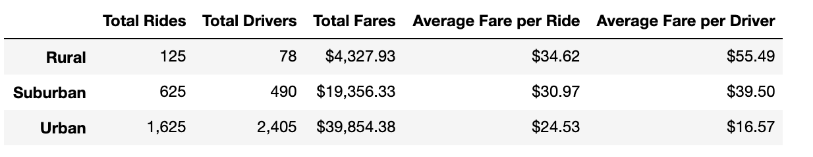
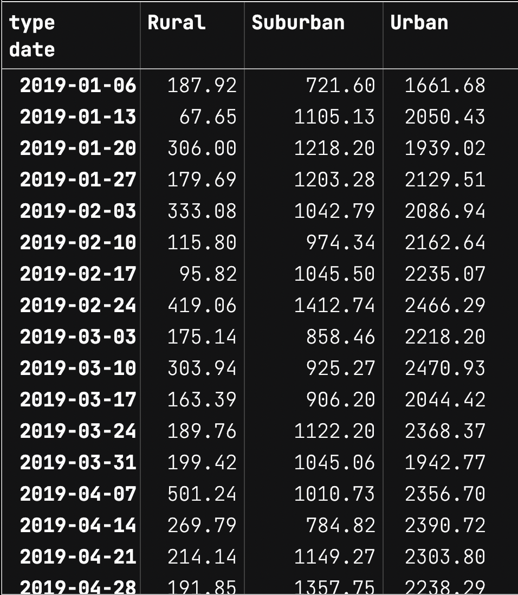

# Module 5 | Assignment - PyBer

## Overview

The first assignment at *Pyber*, a python-based rideshare company, for a new data analyst is to  perform an exploratory analysis on a [large set of ride data](https://github.com/luperrin/05-PyBer-lukeperrin/blob/main/Pyber_Challenge/Resources/ride_data.csv) with a [corresponding dataset about the driver workforce](https://github.com/luperrin/05-PyBer-lukeperrin/blob/main/Pyber_Challenge/Resources/city_data.csv).

The goal of this assignment is to find correlations between the provided fields using data wrangling via `pandas`. These include:

- `city`
- `date`
- `fare`
- `ride_id`
- `driver_count`
- `type` (of city, i.e. rural, suburban, or urban)

To highlight these findings of correlative data in the set, we will look to generate convincing visualizations of the wrangled data. Pyber intends to use the interpretation of this data to improve accessibility and affordability of their product for unreached areas.

## Results

### Preparation and Wrangling of Raw Data

The execution of the python file ([PyBer_Challenge.ipynb](https://github.com/luperrin/05-PyBer-lukeperrin/blob/main/Pyber_Challenge/PyBer_Challenge.ipynb)) provides the following dataframes to help assess interdependent fields. The following steps enabled their respective dataframes to generate, slowly exposing the data’s meaning from the large set.

Each CSV file is read using `pd.read_csv()`:

-  `city_data_df` from [city_data.csv](https://github.com/luperrin/05-PyBer-lukeperrin/blob/main/Pyber_Challenge/Resources/city_data.csv)
-  `ride_data_df` from [ride_data.csv](https://github.com/luperrin/05-PyBer-lukeperrin/blob/main/Pyber_Challenge/Resources/ride_data.csv)

#### Relationships within each file

##### City Data

In `city_data_df`, each `city` (unique index in this file) is categorized into one of three city `types`:

1. *Rural*
2. *Suburban*
3. *Urban*

Each `city` also holds a respective number of drivers (i.e. `driver_count`).

##### Ride Data

In `city_data_df` from each field in `ride_data_df `is independent of the other fields. Each index is unique across all fields (except for `city` ), meaning there are a certain number of rides associated with each.

#### Merging of the two data source files using `pd.merge()`

 `city_data_df` is merged into `ride_data_df`, **as DataFrame `pyber_data_df`,** by matching the two indexes by `city`. By doing this, we are now able to relationally bridge these two datasets through the shared field of `city`. 

By adding the `city` information from   `city_data_df` as new fields to each instance of matching `city` indices in  `ride_data_df`, we are able to also categorize each `ride_id`, `date`, and `fare` into the city `type` categorically.

The merged DateFrame appears as shown below:

#### Categorization of Indices with `.groupby()`

In order to group all rows by city `type`, the categorizations of each total was accompished by using `pyber_data_df.groupby(["type"]).`

#### Summation of Totals with `.count()` and `sum()`

In order to calculate the totals of each…

1. Total `ride_id`s,
2. Total `driver_count`, and 
3. Total ride `fare`s

we will need to derive a total with either the `.count()` or `.sum()` of each `pyber_data_df[“<header>”]`. Total `ride_id`s and total ride `fare`s are straight foward to get by using `.count()` and `.sum()` respectively. However, total `driver_count` is a bit more complex.

If we were to use `.count()` on either  `city_data_df['driver_count']` or `pyber_data_df['driver_count']`, we would be counting for the number of numbers listed (i.e. the number of rows).

If we were to use `.sum()` on  the merged `pyber_data_df['driver_count']`, we would be adding each `driver_count` multiplied by each time a ride occured in that city.

We will need to use the `.sum()` method only with `driver_count` directly from the original `city_data_df` source. This is due to the fact that because we are already provided the number of drivers as a count of each city. 

This last set of `.sum()`s are the correct values and are saved to each “Total `driver_count`” by `type` variable.

#### Resulting Tables and Charts

*Summary of totals and averages by city `type`:*

*Sum of total `fares` by week (parsed from `date`) and by city `type`:*

*Multiline chart demonstrating the weekly sums of ride fares by city `type`*

#### Analysis by City Type against…

- ***Total Rides***
  - As one might expect, `urban` city types had the largest number of *Total Rides* where as `rural` types had the smallest total.
- ***Total Drivers***
  - Following from *Total Rides*, the number of *Total Drivers* follows the same trend.
  - There are actually more *Total Drivers* than *Total Rides* for `urban` city types.
-  ***Total Fares***
  - Again, the correlation continues to follow from *Total Rides* and *Total Drivers* since these values are all interdependent.
- ***Average Fare per Ride***
  - We begin seeing an interesting trend appear in the averages, though perhaps not unexpected. The *Average Fare per Ride* was highest for `rural` types and lowest for `urban`.
  - This may be attributed to the fact that the less metropolitian the area you are ridesharing in, the shorter the distance you are probably needing to travel.
- ***Average Fare per Driver***
  - The same correlation is found between these types in respect to the *Average Fare per Driver*. This is expected as this value depends on both strong correlations of the other totals and averages.
  - Additionally, these last values support the idea that the rideshare market is highly influenced by the concept of “*supply and demand*”. 
    - Although there is a high demand for rides in `urban` cities, the profit is low for `drivers` here as the supply exceeds the demand.
    - Similarly, rides are more expensive in `rural` areas (and present higher profits to drivers) since there are less drivers to meet the demand for rides.

## Summary

Based on these results, three recommendations are proposed to address each of the city `types` :

### 1. Urban Strategy

Due to the disproportionate ratio of drivers to rides, it is recommended that the number of drivers are reduced in `urban` areas. This would require a disemployment of the driver workforce as if they were to dissipate into `suburban` and `rural` areas, their large numbers would also exceed the demand for rides in either.

Another solution would be to decrease the cost of rides even further to discourage drivers from overwhelming fleet and also to encourage more urban-dwellers to participate in rideshare services.

### 2. Suburban Strategy

The `suburban` cities seem to have a better ratio of drivers : rides than `urban` cities, but is not independtly great either. I would implement a similar strategy here as suggested for `urban` cities. The release of drivers may not be necessary in this case, since price control may even these numbers out.

### 3. Rural Strategy

The proportion of drivers : rides is much better here, and the profits show as such. However, the numbers for these areas seem quite low even for being lowly populated. I would focus to advertise in these areas as rideshare services may be uncommonly known or understood. The reason why there may be less drivers in these areas may be because drivers are less inclined to commit to long rideshare requests than the shorter distance ones more likely to happen in `urban` cities.

